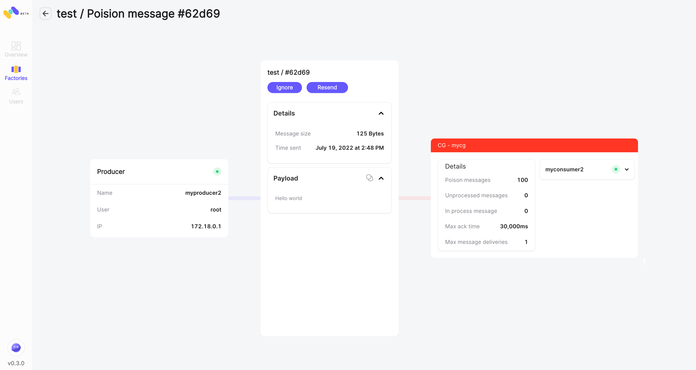

# Dead-letter-Station

**Poison messages** = Messages that cause a consumer group to repeatedly require a delivery (possibly due to a consumer failure) such that the message is never processed completely and acknowledged so that it can be stopped being sent again to the same consumer.

**Example**: Some message on an arbitrary station pulled by a consumer of a certain consumer group. That consumer, for some reason, doesn't succeed in handling it. It can be due to a bug, an unknown schema, resources issue, etc…

In Memphis, a message will be declared as "Poison" **when passing the "maxAckDeliveries" value.**

"maxAckDeliveries" is the parameter that defines how many times the broker will try to redeliver the same message to the same CG until receiving an "Ack".

By default, a CG will be created per consumer with its name unless configured differently.

**Example:**&#x20;

 (1).png>)

### Identification

How to identify poison messages?

After receiving an alert from some consumer - head over to Memphis dashboard, identify the station, and reach its station overview.

**Legend**

(1) Dead-letter. In this tab, all of the poisoned messages will be displayed with further options.

(2) Each message's metadata is displayed on the right panel, like Failed CGs.

(3) Amount of poison message per CG. If that number is > 0, you have a growing issue.

(4) Show the defined parameter.

Each message that crosses the number of redeliveries per CG will create and preserved automatically in the Dead-letter-station.


Dead-letter-station (DLS) message retention is 3 hours


The dead-letter-station will not be created unless there is a reason.

.png>)

### Recovery

Once poison messages start to pile up - the dead-letter-station will take place and enable the engineer to inspect it at the dedicated tab.

**Legend**

(1) Ignore = Removes a message from the DLS.

(2) **Resend** = Resends the poisoned message back to the **same CGs** that flagged it as poisoned without any intervention from the consumer side.

(3) Ability to resend/ignore multiple poisoned messages at once.

(4) Message Journey = A dedicated view of a single message path from producer to all of its consumers

.png>)

###

### Message Journey

After clicking on "Message Journey", the user will be redirected to this screen which is in the context of a single message.

**On the left**, the user can find the producer which produced the message.

**In the middle** are the message and its metadata itself.

**On the right**, the consumers that consume the message and do not acknowledge it, which cause the message to be flagged as "poison".
