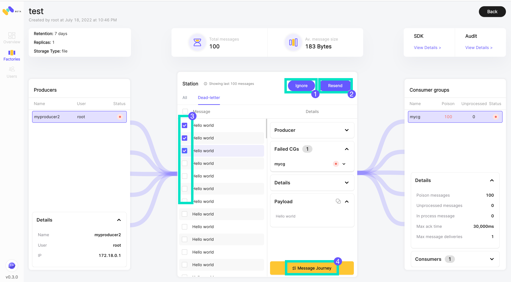

# Dead-letter Station (DLQ)

## Introduction

Dead-letter station will often be named "Dead-letter queue" in other messaging systems.

Dead-letter station (=queue) is both a concept and a solution that is useful for debugging clients because it lets you isolate and "recycle" instead of drop unconsumed messages to determine why their processing doesn't succeed.

Upon creation of a Memphis station, a dead-letter station will be created by default since it does not consume any resources or storage unless there are messages.

Once the user has debugged the consumer application or the consumer application is available to consume the message, a retransmit can take place directly from the dead-letter station according in the following methods

* Move the messages back to the source station with just a click of a button on the Memphis GUI
* Retransmit the message directly to the unconsumed consumer
* Consume the message directly through the SDK from any consumer
* Drop the message from the Dead-letter station

## Terminology

**Poison messages** = Messages that cause a consumer group to repeatedly require a delivery (possibly due to a consumer failure) such that the message is never processed completely and acknowledged so that it can be stopped being sent again to the same consumer.

**Example**: Some message on an arbitrary station pulled by a consumer of a certain consumer group. That consumer, for some reason, doesn't succeed in handling it. It can be due to a bug, an unknown schema, a resource issue, etc…

## How do dead-letter stations work?

Sometimes, messages can't be processed because of various possible issues, such as erroneous conditions within the producer or consumer application, bad schema, or an unexpected state change that causes an issue with your application code. For example, if a user places a web order with a particular product ID, but the product ID is deleted, the web store's code fails and displays an error, and the message with the order request is sent to a dead-letter queue.

Occasionally, producers and consumers might fail to interpret aspects of the protocol that they use to communicate, causing message corruption or loss. Also, the consumer's hardware errors might corrupt the message payload or break the consumer itself.

A message will be flagged as "Poison" and sent to the dead-letter station **when passing the `maxAckDeliveries` value.**

`maxAckDeliveries` is the parameter that defines how many times the broker will try to redeliver the same message to the same CG until receiving an "Ack."

<figure><figcaption></figcaption></figure>

### Identification

How to identify poison messages?

After receiving an alert from some consumer - head over to the Memphis dashboard, identify the station, and reach its station overview.

**Legend**

(1) Dead-letter. In this tab, the poisoned messages will be displayed with further options.

(2) Each message's metadata is displayed on the right panel, like Failed CGs.

(3) Amount of poison message per CG. If that number is > 0, you have a growing issue.

(4) Show the defined parameter.

Each message that crosses the number of redeliveries per CG will create and preserved automatically in the Dead-letter-station.


Dead-letter station (DLS) message retention is 3 hours


The dead-letter station will not be created unless there is a reason.

.png>)

### Recovery

Once poison messages start to pile up - the dead-letter-station will take place and enable the engineer to inspect it at the dedicated tab.

**Legend**

(1) Ignore = Removes a message from the DLS.

(2) Resend = Push the poisoned message back to the **same CGs** that flagged it as poisoned without any intervention from the consumer side.

(3) Ability to resend/ignore multiple poisoned messages at once.

(4) Message Journey = A dedicated view of a single message path from the producer to all of its consumers

 (1).png>)

###

### Message Journey

After clicking on "Message Journey," the user will be redirected to this screen which is in the context of a single message.

**Left panel -** The producer of the message

**Center panel -** The message and its metadata.

**Right panel -** the unacknowledged consumer groups.
